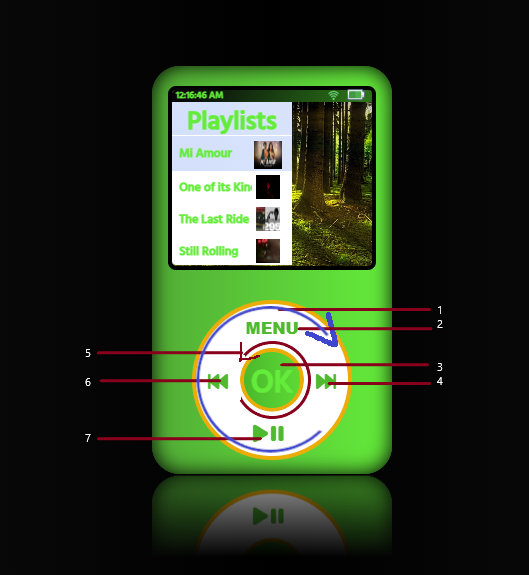

# I-Pod
## [Hosted Link](https://ipod-by-neffi.onrender.com/)
---
 

            

            

                <ol>
					<li>press and hold + rotate clockwise direction to select the next option</li>
                    <li>MENU: previous menu/back button</li>
                    <li>OK: go to the selected option</li>
					<li>next song</li>
					<li>press and hold + rotate counterclockwise direction to go to the previous option</li>
                    <li>previous song</li>
                    <li>play/pause button</li>
                </ol>
            

        

